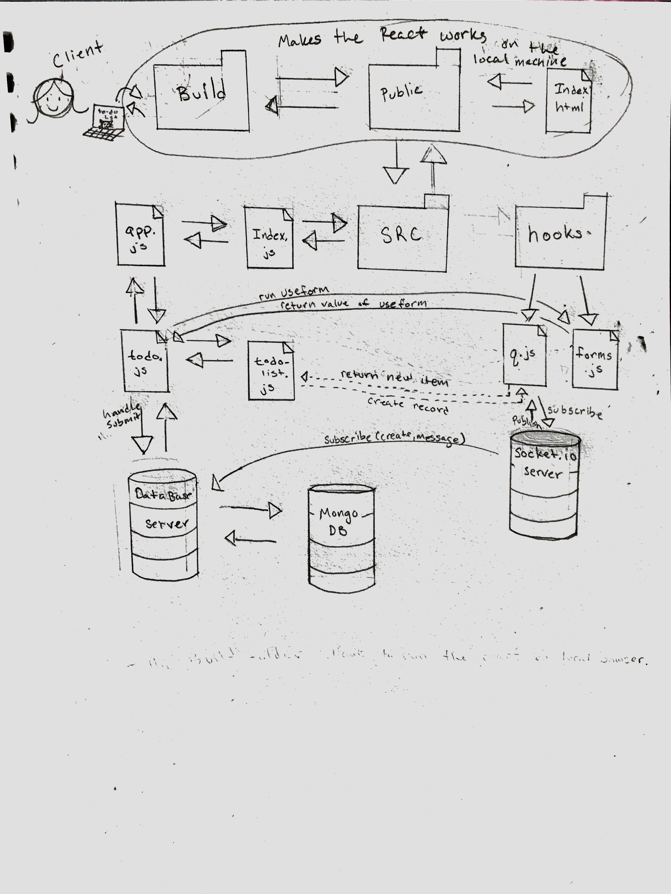

# LAB - 31 and 32

## Hooks

### Author: Liz Kavalski

### Links and Resources

- [submission PR](https://github.com/lizkavalski/lab-32-hooks/pull/3)
- [heruko](https://api-401n13.herokuapp.com/api/v1/todo)-class sever
- [front-end](http://xyz.com) (when applicable)

### Modules

#### `todo.js`

Is a function that reviced infomation(items that needs to be done) from the 'form' and save the infomation to the sever.

#### `todo-list.js`

Is a function the retrives infomation from the sever and renders onto the page.

#### `shopping.js`

Is a function that reviced infomation(items for a shopping list) from the 'form' and save the infomation to the sever.

#### `forms.js`

A hook that handles changes to the page.

#### `q.js`

A hook that handles the socket.io server.

### Setup

#### `.env` requirements

- `PORT` - Port Number
- `MONGODB_URI` - URL to the running mongo instance/db

#### Running the app

- `npm start`
- Endpoint: `/todo`

  - Returns a JSON object with items saved to the sever in it.

#### Tests

- How do you run tests?
- What assertions were made?
- What assertions need to be / should be made?

#### UML

